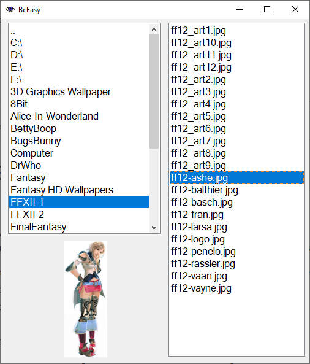

# BcEasy
Simple picture viewer 

I used AcDsee in the old days, just a simple picture viewer without any bells or whistles.
Today it has become a very large program which is slow with large folders because of the indexing of images.
So I wrote my own program like I remembered from that time.

- Choose a folder to see all images in the folder (now jpg/bmp/tiff, can be easily expanded).
- Double click a folder to enter this folder.
- Double click an image to see it in full screen mode.
- Use the scroll wheel to go to the next/previous image.
- Double click again to leave the full screen mode (or use Escape) and go to the browser again.
- In full screen mode right click the mouse to see the image in actual size.
- If the actual size is shown you can pan the image with the left button and adjust the magnification with the scroll wheel.
- Use the right button again to go to the maximized view and then you can go to the next/previous image.

Still working on it to adjust to my liking, but feel free to adjust it to yours ;-)

Copyright (c) 2024 Dirk Prins

Permission is hereby granted, free of charge, to any person obtaining a copy of this software and associated documentation files (the "Software"), to deal in the Software without restriction, including without limitation the rights to use, copy, modify, merge, publish, distribute, sublicense, and/or sell copies of the Software, and to permit persons to whom the Software is furnished to do so, subject to the following conditions:

The above copyright notice and this permission notice shall be included in all copies or substantial portions of the Software.

THE SOFTWARE IS PROVIDED "AS IS", WITHOUT WARRANTY OF ANY KIND, EXPRESS OR IMPLIED, INCLUDING BUT NOT LIMITED TO THE WARRANTIES OF MERCHANTABILITY, FITNESS FOR A PARTICULAR PURPOSE AND NONINFRINGEMENT. IN NO EVENT SHALL THE AUTHORS OR COPYRIGHT HOLDERS BE LIABLE FOR ANY CLAIM, DAMAGES OR OTHER LIABILITY, WHETHER IN AN ACTION OF CONTRACT, TORT OR OTHERWISE, ARISING FROM, OUT OF OR IN CONNECTION WITH THE SOFTWARE OR THE USE OR OTHER DEALINGS IN THE SOFTWARE.
